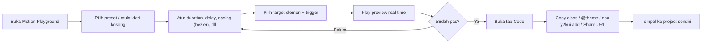

# PRD — Motion Playground

> **Product:** Y2K UI — Component Library & Playground
> **Fitur:** Motion / Animation Playground (tool playground ke-4)
> **Status:** Draft v1.0
> **Pemilik:** zafar.syah
> **Terakhir diperbarui:** 25 Juni 2026

---

## 1. Ringkasan (TL;DR)

**Motion Playground** adalah tool di hub `/playground` yang memungkinkan pengguna **merancang animasi & transisi tanpa menulis kode** — atur semua properti animasi (duration, delay, easing, iteration, direction, fill-mode) lewat kontrol visual, lihat **preview langsung di komponen Y2K nyata**, lalu **copy/export** hasilnya sebagai class Tailwind, blok `@theme`/`@keyframes`, atau perintah `npx y2kui add <preset>`.

Pembeda utama dari tool sejenis (mis. `tailwindcss-animated.com`): tersedia **editor easing `cubic-bezier` interaktif** (drag handle) dan **output Tailwind v4 CSS-first** (`@theme`) yang langsung kompatibel dengan `globals.css` project. Fitur ini hemat effort karena **me-reuse keyframes yang sudah ada** (`float`, `spin-slow`, `wiggle`, `shimmer`, `marquee`, `y2k-lift`), `component-preview.tsx`, dan `code-block.tsx`.

---

## 2. Latar Belakang & Masalah

Membuat animasi yang "pas" itu **trial-and-error yang melelahkan**: menebak nilai easing, mengetik `@keyframes` manual, dan bolak-balik refresh untuk melihat hasilnya. Untuk component library, animasi yang konsisten adalah bagian dari brand — tapi pengguna tidak punya cara cepat untuk **mencoba & menyalin** animasi yang sesuai gaya Y2K.

Project Y2K UI sudah punya banyak keyframes di `globals.css` dan memakai pendekatan **Tailwind v4 CSS-first** (`tw-animate-css`). Yang hilang adalah **antarmuka interaktif** untuk meracik animasi dari properti-properti itu dan mengekspornya. Tool seperti `tailwindcss-animated.com` membuktikan model "configurator → copy class" sangat diminati; Motion Playground membawanya ke dalam ekosistem Y2K UI + menambah **bezier easing editor** sebagai nilai lebih.

### Mengapa sekarang
- Keyframes & utilitas animasi sudah ada di `globals.css` → tinggal diekspos ke UI.
- Pendekatan Tailwind v4 `@theme` sudah dipakai → output langsung nyambung.
- Melengkapi trio playground (Form Builder, Theme Generator, Component Explorer) dengan dimensi **motion** — DX tinggi, banyak reuse.

---

## 3. Tujuan & Non-Tujuan

### 3.1 Tujuan (Goals)
1. Sediakan **configurator interaktif** untuk semua properti animasi CSS (duration, delay, iteration-count, direction, fill-mode, timing-function).
2. **Editor `cubic-bezier` visual** (drag handle) + preset easing populer.
3. **Live preview real-time** di komponen Y2K nyata (button, badge, card, dialog, dll) dan elemen dasar (box, text, image).
4. **Galeri preset animasi** Y2K (reuse existing + tambahan) yang bisa di-customize on-the-fly.
5. **Export multi-format**: class Tailwind, blok `@theme`/`@keyframes` untuk `globals.css`, dan `npx y2kui add <preset>`.
6. **Trigger preview**: hover, tap/click, scroll/entrance, dan loop — agar terasa seperti micro-interaction nyata.
7. **Share via URL** + hormati `prefers-reduced-motion` di output.
8. **Responsif penuh di berbagai device** (mobile, tablet, desktop) — layout adaptif, dapat dioperasikan dengan sentuhan, tanpa kehilangan fungsi inti.
9. Konsisten penuh dengan **design guideline Y2K** (flat, no heavy shadow, border navy, window motif).

### 3.2 Non-Tujuan (Non-Goals)
- ❌ Timeline multi-track / orkestrasi animasi kompleks (sequence antar banyak elemen). *Roadmap.*
- ❌ Editor animasi SVG path / morphing. *Roadmap.*
- ❌ Memaksa dependency runtime (Motion/Framer) — output utama tetap CSS/Tailwind; Motion hanya opsional.
- ❌ Auth / akun pengguna untuk MVP (state cukup URL/localStorage).
- ❌ Membuat komponen baru (itu domain Component Explorer / Form Builder).

---

## 4. Target Pengguna

| Persona | Kebutuhan | Cara Motion Playground membantu |
|---|---|---|
| **Developer Y2K UI** | Animasi konsisten tanpa nulis keyframes | Configurator → copy class / `@theme` |
| **Designer / hobbyist** | Eksperimen easing & micro-interaction | Bezier editor + preview real-time |
| **Pengunjung baru** | "Coba dulu" rasa animasi library | Galeri preset + share URL |

---

## 5. Penempatan & Navigasi

Mengikuti arsitektur hub yang sudah ada:

```
Navbar → Playground (/playground)
  ├── Form Builder          (Live)
  ├── Theme Generator       (Live)
  ├── Component Explorer     (Live)
  ├── Motion Playground      (Live)  ◀── FITUR INI  → /playground/motion
  └── ...                   (Coming Soon)
```

- Tambahkan kartu **"Motion Playground"** di hub (status `Beta` saat awal, lalu `Live`).
- Route mendukung query share, mis. `?preset=wiggle&dur=500&ease=...`.
- Ikon disarankan: ⚡ atau glyph gerak Y2K.

---

## 6. Spesifikasi Fitur

Layout 3 area yang **responsif & adaptif** (desktop = 3 area berdampingan; tablet = panel kontrol collapse; mobile = bertumpuk via tab/drawer). Lihat §8.5 untuk perilaku responsif rinci.

Desktop:

```
┌─────────────────┬─────────────────────────┬──────────────┐
│  PANEL KIRI    │     PANEL TENGAH         │  PANEL KANAN  │
│  Preset gallery│   Live Preview (kanvas)  │  Controls     │
│  + target elem │   + tombol Play/Replay   │  + Bezier     │
│                │   + Tab Code di bawah    │    editor     │
└───────────────┴─────────────────────────┴──────────────┘
```

### 6.1 Panel Kiri — Preset Gallery & Target
- **Galeri preset animasi** (klik untuk memuat ke editor):
  - Reuse existing: `float`, `spin-slow`, `bounce-slow`, `wiggle`, `shimmer`, `marquee`, `y2k-lift`, `glow-pulse`, `draw`.
  - Tambahan umum: `fade` (+ up/down/left/right), `flip-up/down`, `jump`, `shake`, `ping`, `pulse`, `rotate-x/y`.
- **Target elemen preview**: pilih di elemen apa animasi diuji — Button, Badge, Card/Window, Dialog, Text, Image, atau Box polos.

### 6.2 Panel Tengah — Live Preview + Code
- **Preview area**: elemen target dengan animasi terkini di atas background dotted-grid (reuse `component-preview.tsx`).
  - Tombol **Play / Replay / Pause**.
  - Toggle **loop** dan tampilkan **trigger** (autoplay / hover / tap / scroll).
- **Tab Code** (bawah, reuse `code-block.tsx`): output ter-generate (lihat §6.4) + tombol Copy + chip `npx y2kui add <preset>`.

### 6.3 Panel Kanan — Controls + Bezier Editor
**Kontrol properti animasi:**
| Properti | Kontrol UI |
|---|---|
| `animation-duration` | Slider + input (ms) |
| `animation-delay` | Slider + input (ms) |
| `animation-iteration-count` | Number / toggle `infinite` |
| `animation-direction` | Select: normal / reverse / alternate / alternate-reverse |
| `animation-fill-mode` | Select: none / forwards / backwards / both |
| `animation-timing-function` | **Bezier editor** + preset (ease, ease-in-out, dll) |
| Trigger | Select: autoplay / hover / tap / scroll |

**Bezier editor (pembeda utama):**
- Kurva `cubic-bezier` dengan **handle yang bisa di-drag** (juga keyboard-operable).
- Preset easing populer + dukungan nilai Y di luar 0–1 (overshoot/spring-like).
- Menampilkan nilai `cubic-bezier(x1, y1, x2, y2)` real-time.

### 6.4 Output / Export
Tab Code menampilkan beberapa format (masing-masing dengan tombol Copy):
1. **Class Tailwind (arbitrary value)** — contoh: `animate-[wiggle_0.5s_cubic-bezier(0.34,1.56,0.64,1)_infinite]`.
2. **Blok `@theme` + `@keyframes`** untuk ditempel ke `globals.css` (Tailwind v4 CSS-first):
   ```css
   @theme { --animate-pop: pop 0.32s cubic-bezier(0.34,1.56,0.64,1); }
   @keyframes pop { from { /* ... */ } to { /* ... */ } }
   ```
3. **CSS murni** — properti `animation`/`transition` lengkap (untuk non-Tailwind).
4. **`npx y2kui add <preset>`** — untuk preset animasi terkurasi (lihat Open Question Q2).
5. *(Opsional)* **Snippet Motion** — `transition= ... ` untuk efek spring/fisika.
Semua output **deterministik** dan menyertakan pembungkus `@media (prefers-reduced-motion: reduce)` bila relevan.

---

## 7. Alur Pengguna (User Flow)



---

## 8. Persyaratan Fungsional

### 8.1 Editing Animasi
- Semua properti punya nilai default wajar; perubahan **non-destruktif** (ada Reset).
- Memilih preset mengisi semua properti + keyframes terkait, lalu bisa di-tweak.
- Bezier editor mendukung drag handle, klik bidang, dan **navigasi keyboard**.

### 8.2 Generasi Kode
- Output **deterministik** (konfigurasi sama → kode sama).
- Format class Tailwind memakai sintaks arbitrary value (`animate-[...]`) yang valid di Tailwind v4.
- Blok `@theme`/`@keyframes` mengikuti struktur `globals.css` existing (CSS-first).
- Sertakan opsi `prefers-reduced-motion` pada output `@theme`/CSS.

### 8.3 Preview & State
- Animasi ter-apply real-time tanpa reload; tombol Play/Replay/Pause berfungsi.
- State (preset + semua properti + target + trigger) ter-encode ke **URL** + cadangan `localStorage`.

### 8.4 Integrasi
- Tautan ke Docs animasi & ke **Theme Generator** (motion settings bisa selaras).
- Preset yang sama dengan `globals.css` project agar hasil konsisten saat dipakai.

### 8.5 Responsif & Mobile (Wajib)
Fitur ini **harus berfungsi penuh di berbagai ukuran layar** — mobile, tablet, dan desktop. Tidak boleh ada fungsi inti yang hilang di layar kecil; yang berubah hanya tata letaknya.

**Breakpoint & tata letak adaptif:**
| Breakpoint | Tata letak |
|---|---|
| **Desktop** (≥ 1024px) | 3 area berdampingan: Preset+Target │ Preview+Code │ Controls+Bezier. |
| **Tablet** (640–1023px) | Panel kiri jadi **drawer/collapsible**; Preview dan Controls tersusun atau dalam tab. |
| **Mobile** (< 640px) | Panel **bertumpuk vertikal** dan/atau diakses lewat **tab/bottom-sheet**: (1) Preview + Play, (2) Controls, (3) Bezier, (4) Code — berpindah lewat tab. |

**Persyaratan mobile spesifik:**
- **Galeri preset & target** disembunyikan di balik tombol/drawer agar hemat ruang.
- **Bezier editor** dapat dioperasikan dengan sentuhan (drag handle berukuran sentuh memadai) dan tetap punya fallback input numerik.
- **Target sentuh** minimal 44×44px untuk semua kontrol (slider, select, tombol Play).
- **Tidak ada horizontal-scroll tak disengaja**; code block dapat di-scroll dengan tombol Copy tetap terjangkau.
- **Preview** menyesuaikan lebar container; animasi besar diberi area sendiri.
- Orientasi **portrait & landscape** keduanya didukung.
- Hormati `prefers-reduced-motion` di semua breakpoint (preview & output).

**Pengujian:** verifikasi pada viewport umum (mis. 360×640 mobile, 768×1024 tablet, ≥1280 desktop) dan perangkat sentuh nyata.

---

## 9. Arsitektur Teknis

| Layer | Pilihan |
|---|---|
| Framework | Next.js (App Router) |
| Bahasa | TypeScript |
| Styling / animasi | **Tailwind v4 `@theme` + `@keyframes`** (sejalan `tw-animate-css`) — output utama |
| Easing editor | Kurva `cubic-bezier` interaktif (canvas/SVG), keyboard-operable |
| State | `zustand` (atau `useReducer`) menyimpan `MotionConfig` |
| Preview | reuse `component-preview.tsx` (kanvas dotted-grid) |
| Code highlight | reuse `code-block.tsx` |
| Runtime opsional | **Motion** (`motion/react`) untuk preset spring/fisika (opt-in) |
| Distribusi | shadcn registry CLI (`npx y2kui add <preset>`) |

### 9.1 Model Data (`MotionConfig`)
```ts
type TriggerType = "autoplay" | "hover" | "tap" | "scroll"
type TargetType = "button" | "badge" | "card" | "dialog" | "text" | "image" | "box"

interface MotionConfig {
  preset?: string            // mis. "wiggle" | "fade-up" | "custom"
  name: string               // nama animasi untuk @theme/@keyframes
  duration: number           // ms
  delay: number              // ms
  iterationCount: number | "infinite"
  direction: "normal" | "reverse" | "alternate" | "alternate-reverse"
  fillMode: "none" | "forwards" | "backwards" | "both"
  easing: {
    type: "preset" | "bezier"
    value: string            // "ease-in-out" | "cubic-bezier(0.34,1.56,0.64,1)"
  }
  keyframes?: Record<string, Record<string, string>> // untuk custom/edit
  target: TargetType
  trigger: TriggerType
  respectReducedMotion: boolean
}
```
`MotionConfig` adalah single source of truth: dipakai untuk preview (→ inline style/CSS var), export (→ class/`@theme`/CSS), dan share (→ URL).

### 9.2 Mekanisme Preview
- `MotionConfig` → dipetakan ke properti animasi pada elemen target (via class arbitrary value atau inline `<style>` scoped).
- Tombol Replay me-restart animasi (mis. remount key / toggle class) agar bisa dilihat berulang.
- Trigger non-autoplay (hover/tap/scroll) disimulasikan di kanvas.

### 9.3 Generator Output
- Susun string `animation` dari properti aktif → bentuk class `animate-[...]`, blok `@theme`/`@keyframes`, atau CSS murni.
- Untuk keyframes custom, serialize map `keyframes` ke blok `@keyframes` yang rapi.

---

## 10. Dependensi & Gap

| Kebutuhan | Status | Aksi |
|---|---|---|
| Keyframes Y2K di `globals.css` | ✅ Ada | Jadikan preset awal |
| `component-preview.tsx` (kanvas) | ✅ Ada | Reuse |
| `code-block.tsx` (highlight) | ✅ Ada | Reuse |
| Pendekatan Tailwind v4 `@theme` | ✅ Ada (`tw-animate-css`) | Acuan output |
| Bezier easing editor | ❌ Belum | Buat (canvas/SVG, keyboard-operable) |
| Definisi preset animasi (data) | ⚠️ Sebagian | Kumpulkan existing + tambahan baru |
| Generator class/`@theme`/CSS | ❌ Belum | Buat util generator |
| Motion (opsional spring) | ❌ Belum | Tambah hanya bila fitur spring diaktifkan |

---

## 11. Guideline Desain (Wajib Konsisten)

UI Motion Playground mengikuti **design system Y2K UI**:
- **Flat, NO heavy/offset shadow** — kesan modern dari motion & layout.
- **Border navy `#1b1b3a`** (window 2–3px, kontrol 2px), **radius 4–8px**.
- **Window motif** (title bar + 3 kotak kontrol `[_ ▢ ✕]`) untuk panel preview & kontrol.
- **Dotted-grid background** pada kanvas preview (konsisten `component-preview.tsx`).
- **Animasi transisi halus** pada UI tool sendiri (reveal, `y2k-lift`) — hormati `prefers-reduced-motion`.
- **Responsif & mobile-friendly** — layout adaptif di semua breakpoint, target sentuh ≥ 44px, dapat dioperasikan dengan sentuhan maupun keyboard (lihat §8.5).
- **Light-only**. Kontrol aksesibel (label, focus ring, keyboard-operable — termasuk bezier editor).

---

## 12. Milestone & Fase (Runtut)

### Fase 0 — Fondasi
- [ ] Tambah kartu **Motion Playground** di hub `/playground` (status `Beta`).
- [ ] Buat route `/playground/motion` (shell 3 area).
- [ ] Definisikan tipe `MotionConfig` + nilai default.

### Fase 1 — Preview & properti dasar
- [ ] Kanvas preview (reuse `component-preview.tsx`) + pilihan target elemen.
- [ ] Kontrol duration/delay/iteration/direction/fill-mode.
- [ ] Tombol Play/Replay/Pause + binding real-time.

### Fase 2 — Easing & bezier editor
- [ ] Bezier editor interaktif (drag handle + keyboard) + preset easing.
- [ ] Integrasi easing ke `MotionConfig` & preview.

### Fase 3 — Preset gallery & trigger
- [ ] Kumpulkan preset (existing `globals.css` + tambahan) jadi galeri.
- [ ] Trigger preview: autoplay / hover / tap / scroll.

### Fase 4 — Code generation & export
- [ ] Generator class Tailwind, blok `@theme`/`@keyframes`, dan CSS murni.
- [ ] Tab Code (reuse `code-block.tsx`) + Copy + chip `npx y2kui add`.
- [ ] Sisipkan `prefers-reduced-motion` di output; encode state ke URL.
- [ ] (Opsional) snippet Motion untuk spring.

### Fase 5 — Responsif, polish & launch
- [ ] Implementasi layout responsif penuh: drawer (tablet/mobile), tab/bottom-sheet untuk Preview/Controls/Bezier/Code di mobile (§8.5).
- [ ] Pastikan bezier editor & kontrol punya target sentuh ≥ 44px; tidak ada horizontal-scroll tak disengaja.
- [ ] Empty/error states di semua breakpoint.
- [ ] Animasi transisi + reveal (hormati reduced-motion).
- [ ] Dokumentasi pemakaian di Docs site.
- [ ] QA a11y, **responsif lintas device (mobile/tablet/desktop, portrait & landscape)**, & cross-browser → status kartu → `Live`.

---

## 13. Metrik Keberhasilan

- **Aktivasi:** % pengunjung yang mengubah ≥1 properti / memilih preset.
- **Konversi:** % sesi yang Copy class / `@theme` / `npx y2kui add`.
- **Penggunaan bezier:** % sesi yang menyentuh bezier editor (mengukur nilai fitur pembeda).
- **Share:** jumlah URL animasi yang dibagikan/dibuka.
- **Mobile usage:** % sesi mobile/tablet yang berhasil meng-export animasi.
- **A11y:** % output yang menyertakan `prefers-reduced-motion`.

---

## 14. Roadmap / Masa Depan

- 🎞️ **Timeline multi-step** — orkestrasi beberapa animasi/elemen dalam satu sequence.
- 🧩 **Sinkron dengan Theme Generator** — motion settings global selaras dengan tema.
- 🤖 **"Copy as AI prompt"** — salin animasi + konteks untuk opencode/Cursor.
- 🌀 **Spring/physics presets** (via Motion) sebagai mode lanjutan.
- 🔗 **Open in Component Explorer** — terapkan animasi ke komponen tertentu lalu eksplor props.
- 🖼️ **Export GIF/preview** untuk dibagikan di sosmed.

---

## 15. Pertanyaan Terbuka (Open Questions)

1. **Q1 — Runtime preview:** cukup CSS/Tailwind, atau sediakan mode **Motion (spring)** sejak awal? *(Rekomendasi: CSS/Tailwind dulu, Motion opsional di fase lanjut.)*
2. **Q2 — Mekanisme `npx y2kui add <preset>`:** daftarkan preset sebagai registry item, atau cukup hasilkan `@theme`/CSS untuk ditempel manual? *(Mirip Open Question di PRD lain — perlu keputusan arsitektur.)*
3. **Q3 — Editor keyframes custom:** sediakan editor keyframe penuh (multi-step) di MVP, atau cukup tweak properti + preset dulu? *(Rekomendasi: properti + preset dulu.)*
4. **Q4 — Cakupan trigger:** dukung keempat trigger (autoplay/hover/tap/scroll) di MVP, atau mulai autoplay+hover saja?
5. **Q5 — Bezier overshoot:** dukung nilai Y di luar 0–1 (efek spring-like) sejak awal? *(Rekomendasi: ya, ini pembeda kuat.)*

---

## Lampiran A — Referensi

- **Configurator model:** `tailwindcss-animated.com` — atur semua properti animasi tanpa kode, JIT-friendly, galeri preset (wiggle/jump/shake/fade/flip/dll).
- **Easing editor:** `cubic-bezier.com` (Lea Verou; drag handle, save library, permalink share), `easings.net` (cheat sheet preset), `epiceasing.com` (ease/spring/bounce).
- **Tailwind v4 CSS-first animasi:** `tw-animate-css` (sudah dipakai project), Tailwind docs `animate-[...]` arbitrary value & `@theme`.
- **Runtime opsional:** Motion (`motion.dev`, eks-Framer Motion) untuk spring/fisika.
- **Inspirasi micro-interaction:** Webflow microinteractions, Awwwards microinteractions, useanimations.com.
- Selaras dengan: **PRD Playground, Form Builder, Theme Generator, Component Explorer** (arsitektur hub, pola export, guideline desain, bagian responsif).
- Pola distribusi: shadcn registry CLI (`npx y2kui add`).
