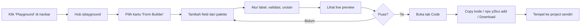

# PRD — Playground & Form Builder

> **Product:** Y2K UI — Component Library & Playground
> **Fitur:** Playground Hub + Form Builder (gaya `formcn.dev`)
> **Status:** Draft v1.0
> **Pemilik:** zafar.syah
> **Terakhir diperbarui:** 23 Juni 2026

---

## 1. Ringkasan (TL;DR)

Kita menambahkan menu **Playground** di navbar website Y2K UI. Halaman ini adalah *hub* berisi beberapa tool interaktif untuk mengeksplorasi & menghasilkan kode komponen. Tool pertama (flagship) adalah **Form Builder** — sebuah visual builder yang memungkinkan pengguna menyusun form lewat klik, melihat live preview bergaya Y2K, dan **menyalin/meng-export kode siap-produksi** (React + React Hook Form + Zod) yang bisa langsung dibawa ke project mereka lewat perintah `npx y2kui add ...`.

Target pengalaman setara dengan [`formcn.dev`](https://formcn.dev), tetapi seluruh komponen & estetika memakai **design system Y2K UI** (flat, border navy tebal, palet pastel, tanpa heavy shadow).

---

## 2. Latar Belakang & Masalah

Membangun form itu **membosankan, repetitif, dan rawan error**: setiap field harus ditulis manual, validasi Zod harus dirakit ulang, dan kode hasil AI sering tidak konsisten atau memakai versi library usang.

Y2K UI sudah punya komponen form (`input`, `button`, `dialog`, `date-picker`, dll.) dan jalur distribusi via **shadcn registry CLI**. Yang belum ada adalah *experience* yang membuat orang bisa **mencoba komponen secara interaktif** dan **merakit form lengkap tanpa menulis boilerplate**. Playground + Form Builder mengisi gap ini sekaligus menjadi corong akuisisi (orang datang untuk tool, lalu mengadopsi library).

### Mengapa sekarang
- Library komponen inti sudah stabil dan ter-publish ke registry.
- Pola distribusi `npx y2kui add <name>` sudah berjalan → Form Builder tinggal menghasilkan kode yang kompatibel.
- Kompetitor (`formcn.dev`, `shadcn-form.com`) membuktikan ada demand kuat untuk kategori ini.

---

## 3. Tujuan & Non-Tujuan

### 3.1 Tujuan (Goals)
1. Menyediakan halaman **Playground hub** yang dapat menampung banyak tool, mudah ditambah ke depannya.
2. Merilis **Form Builder** yang menghasilkan kode **production-ready** (konsisten, ter-typing, terbaru).
3. Output form mendukung **single-step & multi-step (stepper)**.
4. Validasi otomatis dengan **Zod** (client & server).
5. Kode hasil **100% memakai komponen Y2K UI** dan dapat di-export via **`npx y2kui add`** atau **copy-paste**.
6. Konsisten penuh dengan **design guideline Y2K** (flat, border navy, pastel, no heavy shadow).
7. Aksesibel (ARIA, keyboard nav, focus state).

### 3.2 Non-Tujuan (Non-Goals)
- ❌ Backend penyimpanan form submission milik end-user (kita generate kode, bukan jadi form host).
- ❌ Drag-and-drop layout 2 dimensi yang kompleks (cukup reorder vertikal + grouping step). *Bisa jadi roadmap.*
- ❌ Fitur AI prompt-to-form di rilis pertama (jadikan fase lanjutan / "Y2K AI").
- ❌ Autentikasi / akun pengguna untuk MVP (state cukup lokal + share via URL).

---

## 4. Target Pengguna

| Persona | Kebutuhan | Cara Playground membantu |
|---|---|---|
| **Developer React/Next.js** | Cepat merakit form tanpa boilerplate | Builder visual → copy kode jadi |
| **Pengguna baru Y2K UI** | Mau "coba dulu" sebelum install | Preview interaktif tiap komponen |
| **Tim/agency** | Konsistensi kode lintas proyek | Output battle-tested + registry CLI |

---

## 5. Arsitektur Informasi & Navigasi

```
Navbar
├── Components
├── Docs
├── Playground   ◀── BARU
│   ├── /playground                 (Hub: daftar semua tool)
│   ├── /playground/form-builder     (Form Builder — flagship)
│   ├── /playground/<tool-2>          (placeholder roadmap, mis. "Theme Generator")
│   └── /playground/<tool-3>          (placeholder roadmap, mis. "Color Palette")
└── GitHub
```

### 5.1 Navbar
- Tambahkan link **"Playground"** di antara `Docs` dan `GitHub`.
- Beri badge kecil **`NEW`** (Badge variant `lemon`/`pink`) untuk menarik perhatian saat rilis.
- Aktif-state mengikuti styling navbar Y2K yang sudah ada.

### 5.2 Halaman Hub `/playground`
Grid kartu "window Y2K" (title bar + 3 kotak kontrol), tiap kartu = 1 tool:
- Ikon/emoji + nama tool.
- Deskripsi singkat 1 baris.
- Tag status: `Live`, `Beta`, atau `Coming Soon`.
- Hover: `y2k-lift` (motion, bukan shadow).
- Klik kartu `Live` → masuk ke tool; kartu `Coming Soon` → disabled + tooltip.

Kartu pertama: **Form Builder** (status `Live`).

---

## 6. Spesifikasi Fitur — Form Builder

Layout 3 panel (desktop-first; tampilkan notice "works best on desktop" di mobile):

```
┌───────────────┬─────────────────────────┬───────────────┐
│  PANEL KIRI   │      PANEL TENGAH        │  PANEL KANAN  │
│  Field Palette│      Live Preview        │  Settings /   │
│  + Field List │   (form ter-render Y2K)  │  Code Export  │
└───────────────┴─────────────────────────┴───────────────┘
```

### 6.1 Panel Kiri — Palette & Daftar Field
- **Palette**: daftar tipe field yang bisa ditambahkan (klik untuk menambah ke form).
- **Field list**: field yang sudah ada, bisa **reorder** (drag handle / tombol naik-turun) dan **hapus**.
- Untuk multi-step: field dikelompokkan per **Step**; bisa tambah/hapus/rename step.

#### Tipe field yang didukung (MVP)
| Field | Komponen Y2K | Output Zod |
|---|---|---|
| Text input | `Input` | `z.string()` |
| Textarea | `Textarea` | `z.string()` |
| Number | `Input[type=number]` | `z.coerce.number()` |
| Email | `Input[type=email]` | `z.string().email()` |
| Password | `Input[type=password]` | `z.string().min()` |
| Select | `Select` | `z.string()` / enum |
| Multi-select / Tag input | `TagInput` | `z.array(z.string())` |
| Checkbox | `Checkbox` | `z.boolean()` |
| Switch | `Switch` | `z.boolean()` |
| Radio group | `RadioGroup` | `z.enum([...])` |
| Date picker | `DatePicker` | `z.date()` |
| Slider | `Slider` | `z.number()` |
| Stepper (multi-step nav) | `Stepper` | — (struktur) |

> Catatan: beberapa komponen (`Textarea`, `Select`, `Checkbox`, `RadioGroup`, `Slider`, `TagInput`, `Stepper`) mungkin **belum ada** di Y2K UI → lihat §10 Dependensi Komponen.

### 6.2 Panel Tengah — Live Preview
- Render form secara **real-time** persis seperti hasil akhir, memakai komponen Y2K UI.
- Toggle **"Preview" / "Filled state" / "Error state"** untuk melihat tampilan validasi.
- Background dotted-grid Y2K (konsisten dengan `component-preview.tsx` yang sudah dibuat).
- Untuk multi-step: tampilkan navigasi step (Next/Back) yang fungsional di preview.

### 6.3 Panel Kanan — Settings & Code Export
Dua tab:

**Tab "Field Settings"** (saat sebuah field terpilih):
- Label, name (key), placeholder, helper text.
- Required (toggle).
- Aturan validasi spesifik tipe: min/max, regex/pattern, min length, opsi (untuk select/radio), dll.
- Default value.
- Lebar field (full / half — untuk layout 2 kolom).

**Tab "Code"**:
- Tampilkan kode hasil generate dengan tab sub-file:
  - `form.tsx` (komponen form + React Hook Form)
  - `schema.ts` (Zod schema)
  - `action.ts` (server action — opsional, jika server validation aktif)
- Tombol **Copy** per file.
- Blok perintah CLI: **`npx y2kui add <generated-form-name>`** *(lihat §8.3 mode distribusi)*.
- Tombol **"Copy all"** dan **"Download"** (zip / file).

### 6.4 Pengaturan Form-level (global)
- Nama form / judul.
- Mode: **Single-step** atau **Multi-step**.
- Validation: **client-only** atau **client + server (server action)**.
- Layout kolom: 1 kolom / 2 kolom.
- Submit button label.

---

## 7. Alur Pengguna (User Flow)



---

## 8. Persyaratan Fungsional

### 8.1 Generasi Kode
- Kode harus **konsisten & deterministik** (input sama → output sama).
- Memakai stack terbaru: **React 19, Next.js, TypeScript, Tailwind v4, React Hook Form, Zod 4**.
- Form memakai pola `useForm` + `zodResolver`, dengan `Field` components Y2K.
- Aksesibel: `label htmlFor`, `aria-invalid`, `aria-describedby` untuk error.
- Tidak ada dependency tersembunyi; semua import jelas dari `@/components/ui/*`.

### 8.2 Validasi
- Setiap field menghasilkan entry di Zod schema sesuai aturannya.
- Mendukung custom error message per rule.
- Mode server: generate `"use server"` action yang mem-parse `schema.safeParse`.

### 8.3 Mode Distribusi / Export (3 opsi)
1. **Copy-paste** — salin isi tiap file langsung.
2. **Registry CLI** — `npx y2kui add <form-name>`; builder mendaftarkan form sebagai registry item dinamis ATAU menghasilkan registry JSON yang bisa dipasang. *(Lihat Open Question Q3.)*
3. **Download** — unduh file(s) sebagai `.zip`.

### 8.4 Share / Persistensi (MVP ringan)
- State builder di-encode ke **URL query / hash** (atau localStorage), sehingga konfigurasi bisa di-bookmark / dibagikan tanpa backend.
- *(Roadmap: simpan ke akun → "My Forms".)*

---

## 9. Arsitektur Teknis

| Layer | Pilihan |
|---|---|
| Framework | Next.js (App Router) — sudah dipakai project |
| Bahasa | TypeScript |
| Styling | Tailwind CSS v4 + design tokens Y2K (`globals.css`) |
| State builder | `zustand` atau `useReducer` (skema form sebagai single source of truth) |
| Form runtime (preview & output) | React Hook Form + Zod |
| Code highlight | komponen `code-block.tsx` yang sudah ada (Shiki/Prism) |
| Drag & reorder | `dnd-kit` (ringan, accessible) |
| Distribusi | shadcn registry CLI (`y2kui`) |

### 9.1 Model Data (Schema Builder)
```ts
type FieldType =
  | "text" | "textarea" | "number" | "email" | "password"
  | "select" | "multiselect" | "checkbox" | "switch"
  | "radio" | "date" | "slider"

interface FormField {
  id: string
  type: FieldType
  name: string          // key di schema
  label: string
  placeholder?: string
  description?: string
  required: boolean
  defaultValue?: unknown
  options?: { label: string; value: string }[] // select/radio
  validation?: {
    min?: number; max?: number
    minLength?: number; maxLength?: number
    pattern?: string; message?: string
  }
  width?: "full" | "half"
  stepId?: string       // untuk multi-step
}

interface FormStep { id: string; title: string; order: number }

interface FormConfig {
  name: string
  mode: "single" | "multi"
  validation: "client" | "client-server"
  columns: 1 | 2
  submitLabel: string
  steps: FormStep[]
  fields: FormField[]
}
```
`FormConfig` inilah yang di-serialize ke URL dan dipakai oleh generator kode.

---

## 10. Dependensi Komponen (Gap Analysis)

Form Builder butuh komponen berikut. Tandai mana yang **sudah ada** vs **perlu dibuat** di Y2K UI:

| Komponen | Status | Aksi |
|---|---|---|
| `Button`, `Input`, `Badge`, `Switch`, `Dialog`, `DatePicker`, `Tabs` | ✅ Ada | — |
| `Textarea` | ⚠️ Cek | Buat jika belum |
| `Select` | ⚠️ Cek | Butuh (`npx shadcn add select`) lalu re-style Y2K |
| `Checkbox` | ⚠️ Cek | Buat |
| `RadioGroup` | ⚠️ Cek | Buat |
| `Slider` | ❌ Belum | Buat |
| `TagInput` (multi-select) | ❌ Belum | Buat |
| `Stepper` | ❌ Belum | Buat (untuk multi-step) |
| `Form` field primitives (Label/FormMessage) | ⚠️ Cek | Pastikan ARIA siap |

> Semua komponen baru WAJIB mengikuti guideline §11 dan tetap memakai filename tanpa prefix (`select.tsx`, bukan `y2k-select.tsx`) dengan export `Y2K*`.

---

## 11. Guideline Desain (Wajib Konsisten)

Seluruh UI Playground & output Form Builder mengikuti **design system Y2K UI**:

- **Flat, NO heavy/offset shadow.** Kesan modern dari motion & layout, bukan drop-shadow.
- **Border navy `#1b1b3a`** — window 2–3px, input/button 2px.
- **Radius** 4–8px.
- **Palet pastel:** blue `#8ed1fc`, pink `#ff8fcf`, lilac `#b69cff`, mint `#8ff0d0`, lemon `#ffe45e`, panel `#d7dde8`.
- **Window motif:** title bar + 3 kotak kontrol (`[_ ▢ ✕]`) untuk panel/card.
- **Animasi transisi halus** (reveal on scroll, `y2k-lift` hover) — hormati `prefers-reduced-motion`.
- **Dotted-grid background** pada area preview (konsisten dengan `component-preview.tsx`).
- **Light-only** (dark mode dinonaktifkan, sesuai keputusan project).
- Aksesibilitas: focus ring jelas, kontras cukup, keyboard-operable.

---

## 12. Milestone & Fase (Runtut)

> Urutan menghormati prinsip *runtut*: siapkan fondasi → komponen → builder → generator → distribusi → polish.

### Fase 0 — Fondasi navigasi
- [ ] Tambah link **Playground** + badge `NEW` di navbar.
- [ ] Buat route `/playground` (Hub) dengan grid kartu + 1 kartu `Live` (Form Builder) & beberapa `Coming Soon`.
- [ ] Buat shell route `/playground/form-builder` (layout 3 panel kosong).

### Fase 1 — Lengkapi komponen form (gap §10)
- [ ] Bangun/port: `Textarea`, `Select`, `Checkbox`, `RadioGroup`, `Slider`, `TagInput`, `Stepper`.
- [ ] Pastikan semua ber-ARIA & ber-style Y2K.
- [ ] Publish ke registry (`npx y2kui add` bisa memasangnya).

### Fase 2 — Builder engine
- [ ] State management (`FormConfig`) + add/remove/reorder field.
- [ ] Panel kiri (palette + list), panel kanan (field settings).
- [ ] Live preview real-time di panel tengah.
- [ ] Multi-step (steps + navigasi).

### Fase 3 — Code generation
- [ ] Generator `schema.ts` (Zod) dari `FormConfig`.
- [ ] Generator `form.tsx` (RHF + komponen Y2K).
- [ ] Generator `action.ts` (server validation, opsional).
- [ ] Tab Code + Copy + syntax highlight (`code-block.tsx`).

### Fase 4 — Distribusi & share
- [ ] Tombol Copy / Download (zip).
- [ ] Integrasi `npx y2kui add` (registry item / JSON).
- [ ] Serialize state ke URL untuk share.

### Fase 5 — Polish & launch
- [ ] Empty states, error states, mobile notice.
- [ ] Animasi transisi + reveal.
- [ ] Dokumentasi di Docs site (cara pakai Playground).
- [ ] QA aksesibilitas & cross-browser.

---

## 13. Metrik Keberhasilan

- **Aktivasi:** % pengunjung Playground yang menambahkan ≥1 field.
- **Konversi export:** % sesi yang melakukan Copy / `add` / Download.
- **Adopsi library:** kenaikan pemakaian `npx y2kui add` setelah rilis.
- **Kualitas kode:** 0 error TypeScript pada kode yang di-generate (uji otomatis).
- **Engagement:** rata-rata jumlah field per form & % form multi-step.

---

## 14. Roadmap / Masa Depan

- 🤖 **Y2K AI** — prompt-to-form ("buat form pendaftaran event") → auto-scaffold.
- 💾 **My Forms** — simpan & kelola form (perlu auth + backend).
- 🧩 **Tool playground lain**: Theme/Token Generator, Color Palette, Component Explorer, Icon Picker.
- 🔗 **Template gallery** — preset form (login, signup, contact, checkout).
- 📤 Export ke framework lain / v0-style handoff.

---

## 15. Pertanyaan Terbuka (Open Questions)

1. **Q1 — Form runtime library:** React Hook Form (seperti formcn) atau TanStack Form? *(Rekomendasi: RHF + Zod, paling matang & sesuai ekosistem shadcn.)*
2. **Q2 — State management builder:** `zustand` vs `useReducer`? *(Rekomendasi: `zustand` agar mudah serialize & share.)*
3. **Q3 — Mekanisme `npx y2kui add` untuk form dinamis:** apakah generate registry JSON on-the-fly (butuh endpoint) atau cukup copy-paste + `add` untuk dependency komponennya saja? *(Perlu keputusan arsitektur.)*
4. **Q4 — Drag-and-drop:** pakai `dnd-kit` penuh sejak MVP, atau cukup tombol reorder dulu?
5. **Q5 — Mobile:** read-only preview saja, atau full builder responsif?

---

## Lampiran A — Referensi

- Inspirasi utama: [`formcn.dev`](https://formcn.dev) (open-source, oleh Ali Hussein).
- Pembanding: `shadcn-form.com`, `shadcn-builder.com`.
- Pola distribusi: shadcn registry CLI (sudah dipakai `y2kui`).
