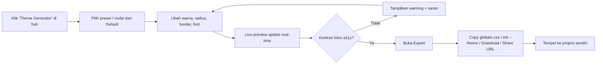

# PRD — Theme Generator (Playground)

> **Product:** Y2K UI — Component Library & Playground
> **Fitur:** Theme / Token Generator (tool playground ke-2)
> **Status:** Draft v1.0
> **Pemilik:** zafar.syah
> **Terakhir diperbarui:** 23 Juni 2026

---

## 1. Ringkasan (TL;DR)

**Theme Generator** adalah tool di hub `/playground` yang memungkinkan pengguna **meng-customize seluruh design token Y2K UI** (warna pastel, ketebalan border, radius, font, dll) lewat kontrol visual (color picker + slider + toggle), melihat **live preview semua komponen** berubah secara real-time, lalu **meng-export hasilnya** sebagai `globals.css`, blok `@theme`, atau perintah `npx y2kui init --theme=...`.

Tujuannya: mengubah Y2K UI dari "satu tema bawaan" menjadi **sistem yang bisa di-rebrand**, sehingga pengguna bisa membuat varian mereka sendiri (mis. *Y2K Mint*, *Vaporwave*, *Cyber Pink*) tanpa menyentuh kode. Ini adalah fitur paling membedakan library dari kompetitor dan paling "lengket".

---

## 2. Latar Belakang & Masalah

Y2K UI saat ini ber-ship dengan **satu palet & gaya tetap** (navy `#1b1b3a` + pastel blue/pink/lilac/mint/lemon, border tebal, radius 4–8px). Pengguna yang ingin menyesuaikan brand harus:
- Membaca `globals.css`, mencari token yang benar, dan mengedit manual → lambat & rawan salah.
- Menebak-nebak kombinasi warna yang harmonis & tetap aksesibel.

Tidak ada cara cepat untuk **melihat dampak perubahan token ke seluruh komponen sekaligus**. Theme Generator menyelesaikan ini: ubah token → lihat semua komponen update → export. Pola ini terbukti sukses di ekosistem shadcn (tweakcn, theme editor shadcn).

### Mengapa sekarang
- Token Y2K sudah terstruktur rapi di `globals.css` (`:root` + `@theme inline`) → tinggal diekspos ke UI.
- Playground hub & pola distribusi `npx y2kui init` sudah ada.
- `component-preview.tsx` bisa di-reuse sebagai kanvas preview.

---

## 3. Tujuan & Non-Tujuan

### 3.1 Tujuan (Goals)
1. Mengekspos **semua design token Y2K** ke kontrol visual yang mudah dipahami.
2. **Live preview real-time**: perubahan token langsung tampil di galeri komponen.
3. **Export** ke `globals.css` / blok `@theme` / `npx y2kui init --theme` / copy JSON.
4. **Preset tema** bawaan (mis. Default, Mint, Vaporwave, Cyber Pink, Mono) untuk titik awal.
5. **A11y guard**: cek kontras teks/bg otomatis dan beri peringatan jika gagal WCAG.
6. **Share via URL**: konfigurasi tema ter-encode di URL untuk dibagikan/bookmark.
7. Konsisten penuh dengan **design guideline Y2K** (flat, no heavy shadow, border navy, window motif).

### 3.2 Non-Tujuan (Non-Goals)
- ❌ Membuat token/variabel baru yang belum ada di sistem (hanya meng-customize yang ada). *Roadmap.*
- ❌ Editor dark-mode (project light-only). *Bisa dibuka nanti.*
- ❌ Menyimpan tema ke akun pengguna (MVP cukup URL/localStorage).
- ❌ Generate komponen baru (itu domain Form Builder / Component Explorer).
- ❌ Editor animasi/keyframe penuh (cukup beberapa toggle motion).

---

## 4. Target Pengguna

| Persona | Kebutuhan | Cara Theme Generator membantu |
|---|---|---|
| **Developer yang mengadopsi Y2K UI** | Sesuaikan library ke brand sendiri | Ubah token visual → export `globals.css` |
| **Designer / hobbyist** | Eksplorasi estetika tanpa ngoding | Color picker + preset + live preview |
| **Pengunjung baru** | "Coba-coba" sebelum install | Bermain dengan preset, share hasil |

---

## 5. Penempatan & Navigasi

Mengikuti arsitektur hub yang sudah dibangun di PRD Playground:

```
Navbar → Playground (/playground)
  ├── Form Builder        (Live)
  ├── Theme Generator     (Live)  ◀── FITUR INI  → /playground/theme-generator
  └── ...                 (Coming Soon)
```

- Tambahkan kartu **"Theme Generator"** di hub dengan status `Live` (atau `Beta` saat awal rilis).
- Ikon disarankan: 🎨 atau glyph palet Y2K.

---

## 6. Spesifikasi Fitur

Layout 2 area (desktop-first; mobile = preview read-only + notice):

```
┌──────────────────┬─────────────────────────┐
│  PANEL KIRI       │        PANEL KANAN           │
│  Kontrol Token    │   Live Preview (galeri)      │
│  + Preset         │   semua komponen Y2K         │
│  + Export         │   ter-render dengan tema     │
└──────────────────┴─────────────────────────┘
```

### 6.1 Panel Kiri — Kontrol Token
Dibagi dalam grup yang bisa di-collapse:

**a. Preset Tema** (baris paling atas)
- Daftar preset: `Default`, `Mint`, `Vaporwave`, `Cyber Pink`, `Mono`, dst.
- Klik preset → semua token ter-set, preview update.
- Tombol **Reset** ke Default.

**b. Warna (Colors)**
Color picker + input hex untuk tiap token:
- `--y2k-ink` (navy/teks utama)
- `--y2k-blue`, `--y2k-pink`, `--y2k-lilac`, `--y2k-mint`, `--y2k-lemon`
- `--y2k-panel` (background panel)
- Token semantik shadcn yang terkait (`--background`, `--foreground`, `--primary`, `--border`, dst — sebagian bisa di-derive otomatis).

**c. Bentuk (Shape)**
- `--radius` (slider 0–16px).
- Ketebalan border window (slider 1–4px).
- Ketebalan border input/button (slider 1–3px).

**d. Tipografi (Typography)**
- Pilihan font display, body, mono (dari rekomendasi font Y2K: Space Grotesk, Inter/Geist, JetBrains Mono, dll).
- Skala ukuran dasar (opsional).

**e. Motion** (opsional, ringan)
- Toggle aktif/nonaktif animasi transisi global.
- Kecepatan transisi (preset: snappy / smooth / off).

### 6.2 Panel Kanan — Live Preview
- Galeri komponen Y2K yang representatif: Button (semua variant), Badge, Input, Switch, Progress, Tabs, Dialog (trigger), Card/Window, Avatar, dll.
- Background dotted-grid Y2K (reuse pola `component-preview.tsx`).
- **Real-time**: perubahan token langsung ter-apply (lihat §9.2 mekanisme).
- Toggle tampilan: `Components` / `Sample form` / `Sample dashboard` agar pengguna lihat tema di konteks nyata.

### 6.3 Export
Tombol/menu export menghasilkan:
1. **`globals.css`** — blok `:root { ... }` + `@theme inline` yang sudah ter-update (siap timpa file).
2. **Blok `@theme` saja** — untuk yang mau tempel sebagian.
3. **`npx y2kui init --theme=<id|url>`** — perintah CLI memasang tema saat init *(lihat Open Question Q2)*.
4. **Copy JSON token** — representasi `ThemeConfig` untuk disimpan/dibagikan.
5. **Download** file `globals.css`.
Setiap opsi punya tombol **Copy** dengan feedback "Copied!".

---

## 7. Alur Pengguna (User Flow)



---

## 8. Persyaratan Fungsional

### 8.1 Editing Token
- Semua token punya nilai awal dari Default theme.
- Perubahan bersifat **non-destruktif** (bisa Reset kapan saja).
- Beberapa token semantik shadcn dapat **di-derive otomatis** dari token Y2K inti (mis. `--primary` mengikuti warna aksen terpilih) — dengan opsi override manual.

### 8.2 A11y Contrast Guard
- Hitung rasio kontras (WCAG AA) untuk pasangan kritis: teks/bg, teks tombol/fill tombol, border/bg.
- Tampilkan badge `AA` / `Fail` di sebelah kontrol terkait.
- Beri saran perbaikan ringan (mis. "gelapkan ink" / "naikkan kontras").

### 8.3 Export & Konsistensi
- Output `globals.css` harus **valid & langsung pakai** (struktur `:root` + `@theme inline` sesuai file existing).
- Output deterministik (config sama → file sama).
- Tidak menambah/menghapus token di luar yang dikenal sistem.

### 8.4 Preset & Share
- Minimal 5 preset bawaan.
- State tema ter-encode ke **URL (query/hash)** + cadangan `localStorage`, sehingga bisa dibookmark & dibagikan tanpa backend.

---

## 9. Arsitektur Teknis

| Layer | Pilihan |
|---|---|
| Framework | Next.js (App Router) |
| Bahasa | TypeScript |
| Styling | Tailwind v4 + token Y2K (`globals.css`) |
| State | `zustand` (atau `useReducer`) menyimpan `ThemeConfig` |
| Live preview | Inject CSS variables ke wrapper preview via inline `style` / `<style>` scoped |
| Kontras a11y | util WCAG (mis. fungsi rasio kontras kecil, tanpa dependency berat) |
| Color picker | komponen ringan (mis. `react-colorful`) di-restyle Y2K |
| Code highlight | komponen `code-block.tsx` yang sudah ada |
| Distribusi | shadcn registry CLI (`y2kui init --theme`) |

### 9.1 Model Data (`ThemeConfig`)
```ts
interface ThemeConfig {
  id: string                 // slug preset/custom
  name: string
  colors: {
    ink: string              // --y2k-ink
    blue: string
    pink: string
    lilac: string
    mint: string
    lemon: string
    panel: string
    // token semantik turunan (opsional override)
    background?: string
    foreground?: string
    primary?: string
    border?: string
  }
  shape: {
    radius: number           // px
    windowBorder: number     // px
    controlBorder: number    // px
  }
  typography: {
    display: string          // font family key
    body: string
    mono: string
    baseSize?: number
  }
  motion: {
    enabled: boolean
    speed: "snappy" | "smooth" | "off"
  }
}
```
`ThemeConfig` adalah single source of truth: dipakai untuk preview (→ CSS variables), export (→ `globals.css`), dan share (→ URL).

### 9.2 Mekanisme Live Preview
- `ThemeConfig` → dipetakan ke object CSS custom properties.
- Variabel di-set pada **wrapper preview** (scoped), bukan `:root` global, agar UI builder sendiri tidak ikut berubah.
- Komponen di galeri mewarisi variabel → update otomatis tanpa re-mount.

### 9.3 Generator `globals.css`
- Template `:root { ... }` + `@theme inline` diisi dari `ThemeConfig`.
- Pertahankan komentar & struktur yang sudah ada di file project (light-only note, dst).

---

## 10. Dependensi & Gap

| Kebutuhan | Status | Aksi |
|---|---|---|
| Token Y2K terstruktur di `globals.css` | ✅ Ada | Ekspos ke UI |
| `component-preview.tsx` sebagai kanvas | ✅ Ada | Reuse |
| `code-block.tsx` untuk output | ✅ Ada | Reuse |
| Color picker (Y2K-styled) | ❌ Belum | Integrasi `react-colorful` + restyle |
| Util kontras WCAG | ❌ Belum | Buat util kecil |
| Galeri komponen "showcase" | ⚠️ Sebagian | Rakit dari komponen existing |
| Preset tema (JSON) | ❌ Belum | Definisikan 5+ preset |

---

## 11. Guideline Desain (Wajib Konsisten)

UI Theme Generator mengikuti **design system Y2K UI**:
- **Flat, NO heavy/offset shadow** — kesan modern dari motion & layout.
- **Border navy `#1b1b3a`** (window 2–3px, kontrol 2px), **radius 4–8px**.
- **Window motif** (title bar + 3 kotak kontrol `[_ ▢ ✕]`) untuk panel.
- **Dotted-grid background** pada area preview.
- **Animasi transisi halus** (reveal, `y2k-lift`) — hormati `prefers-reduced-motion`.
- **Light-only**.
- Kontrol (slider, picker, toggle) ber-style Y2K & aksesibel (label, focus ring, keyboard).

> Catatan ironi-positif: tool ini meng-edit tema, jadi **UI builder-nya sendiri tetap memakai Default theme** (variabel preview di-scope), supaya kontrol selalu terbaca apa pun tema yang dibuat pengguna.

---

## 12. Milestone & Fase (Runtut)

### Fase 0 — Fondasi
- [ ] Tambah kartu **Theme Generator** di hub `/playground` (status `Beta`).
- [ ] Buat route `/playground/theme-generator` (shell 2 panel).
- [ ] Definisikan `ThemeConfig` + Default theme dari `globals.css`.

### Fase 1 — Preview engine
- [ ] Mapping `ThemeConfig` → CSS variables (scoped wrapper).
- [ ] Rakit galeri komponen showcase di panel kanan.
- [ ] Verifikasi update real-time saat config berubah.

### Fase 2 — Kontrol
- [ ] Color picker Y2K untuk semua warna.
- [ ] Slider radius & border.
- [ ] Pemilih font (display/body/mono).
- [ ] Toggle motion.

### Fase 3 — Preset & A11y
- [ ] 5+ preset tema (Default, Mint, Vaporwave, Cyber Pink, Mono).
- [ ] Util kontras WCAG + badge `AA`/`Fail` + saran.
- [ ] Tombol Reset.

### Fase 4 — Export & Share
- [ ] Generator `globals.css` + blok `@theme`.
- [ ] Copy JSON, Download, dan `npx y2kui init --theme`.
- [ ] Encode state ke URL untuk share.

### Fase 5 — Polish & launch
- [ ] Empty/error states, mobile notice.
- [ ] Animasi transisi + reveal.
- [ ] Dokumentasi di Docs site.
- [ ] QA a11y & cross-browser → ubah status kartu jadi `Live`.

---

## 13. Metrik Keberhasilan

- **Aktivasi:** % pengunjung yang mengubah ≥1 token / memilih preset.
- **Konversi export:** % sesi yang Copy `globals.css` / `init --theme` / Download.
- **Share:** jumlah URL tema yang dibagikan/dibuka.
- **A11y:** % tema yang di-export lolos kontras AA (target: dorong setinggi mungkin).
- **Adopsi:** kenaikan pemakaian `npx y2kui init` setelah rilis.

---

## 14. Roadmap / Masa Depan

- 🌙 **Dark mode editor** (jika project membuka dark mode).
- 🤖 **AI palette** — "buat tema vaporwave hangat" → auto-generate token.
- 💾 **My Themes** — simpan & kelola tema (perlu auth + backend).
- 🖼️ **Export gambar** — kartu preview tema untuk dibagikan di sosmed.
- 🔌 **Sinkron dengan Component Explorer & Form Builder** — tema aktif ikut ter-apply di tool lain.
- 🧩 **Import dari `globals.css`** — tempel file → builder membaca token yang ada.

---

## 15. Pertanyaan Terbuka (Open Questions)

1. **Q1 — Cakupan token semantik:** seberapa banyak token shadcn (`--primary`, `--secondary`, dst) yang diekspos manual vs di-derive otomatis dari warna Y2K inti? *(Rekomendasi: derive default + override opsional.)*
2. **Q2 — Mekanisme `npx y2kui init --theme`:** baca dari URL/ID hosted, atau cukup hasilkan `globals.css` untuk ditimpa manual? *(Perlu keputusan arsitektur, mirip Q3 di PRD Form Builder.)*
3. **Q3 — Color picker library:** `react-colorful` (ringan) vs build sendiri agar 100% Y2K? *(Rekomendasi: `react-colorful` + restyle.)*
4. **Q4 — Font loading:** font preview di-load via `next/font` saat dipilih, atau set terbatas yang sudah di-bundle? *(Pertimbangan performa.)*
5. **Q5 — Scope vs global preview:** apakah pengguna butuh opsi "apply ke seluruh situs" untuk merasakan tema penuh, atau cukup scoped preview?

---

## Lampiran A — Referensi

- Inspirasi: tweakcn / shadcn theme editor.
- Selaras dengan: **PRD Playground & Form Builder** (arsitektur hub, pola export, guideline desain).
- Pola distribusi: shadcn registry CLI (`npx y2kui init`).
