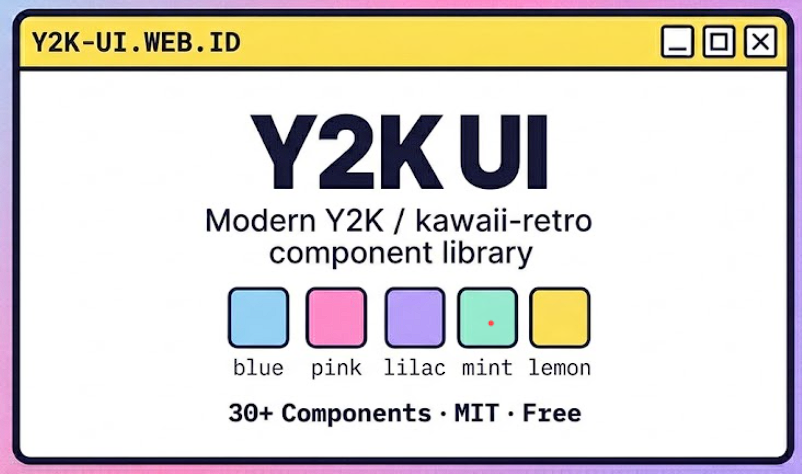

<p align="center">
  
</p>

<h3 align="center"><b>Modern Y2K / kawaii-retro component library</b></h3>

<p align="center">
  Flat windows, thick navy outlines, pastel fills.<br/>
  Built on <a href="https://ui.shadcn.com/">shadcn</a> + <a href="https://www.radix-ui.com/">Radix UI</a>.
</p>

<p align="center">
  <a href="https://opensource.org/licenses/MIT"></a>
  <a href="https://nextjs.org"></a>
  <a href="https://www.typescriptlang.org"></a>
  <a href="https://tailwindcss.com"></a>
</p>

---

## What is Y2K UI?

Y2K UI is a **free, open-source React component library** that brings the Y2K aesthetic to modern web development. Think flat window chrome, title bars with `[_ ▢ ✕]` controls, and crisp pastel fills — no glassmorphism, no Win98 bevel, no neobrutalism offset shadow.

## Features

- **30+ Components** — buttons, inputs, dialogs, forms, navigation, and more
- **Y2K Aesthetic** — flat windows, thick 2-3px navy outlines, pastel fills, 4-8px radius
- **CLI Installation** — `npx y2kui add <component>` for zero-config setup
- **Fully Accessible** — built on Radix UI with keyboard navigation and ARIA support
- **TypeScript First** — complete type definitions for every component
- **Tree-Shakeable** — import only what you need
- **MIT License** — free for personal and commercial use

## Quick Start

```bash
# Initialize your project (one time)
npx y2k-ui-lib@latest init

# Add a component
npx y2kui add button
```

### Prerequisites

- **Next.js 14+** (App Router) or any React framework with Tailwind CSS
- **Tailwind CSS 4** or later
- **TypeScript** (recommended)

## Components

| Category         | Components                                                                                                              |
| ---------------- | ----------------------------------------------------------------------------------------------------------------------- |
| **Layout**       | Aspect Ratio, Card, Resizable, Separator, Scroll Area                                                                   |
| **Forms**        | Button, Input, Textarea, Select, Checkbox, Radio Group, Switch, Slider, Form, Field, Input OTP, Native Select, Combobox |
| **Navigation**   | Breadcrumb, Dropdown Menu, Menubar, Navigation Menu, Pagination, Tabs, Sidebar                                          |
| **Feedback**     | Alert, Alert Dialog, Dialog, Drawer, Popover, Tooltip, Sonner, Progress, Skeleton, Spinner                              |
| **Data Display** | Avatar, Badge, Table, KBD, Hover Card, Calendar, Date Picker, Chart, Carousel                                           |
| **Overlay**      | Command, Context Menu, Sheet, Toggle, Toggle Group, Collapsible                                                         |

## Design Tokens

The Y2K palette is exposed as CSS custom properties on `:root`:

| Token         | Value     | Usage                |
| ------------- | --------- | -------------------- |
| `--y2k-ink`   | `#1b1b3a` | Outlines & body text |
| `--y2k-blue`  | `#8ed1fc` | Primary              |
| `--y2k-pink`  | `#ff8fcf` | Accent               |
| `--y2k-lilac` | `#b69cff` | Secondary            |
| `--y2k-mint`  | `#8ff0d0` | Success              |
| `--y2k-lemon` | `#ffe45e` | Highlight            |
| `--y2k-panel` | `#d7dde8` | Surface              |

## Manual Setup

If you prefer to skip the CLI, copy `components/ui/*` and `lib/utils.ts` from this repo into your project and merge the tokens from `app/globals.css`.

## Documentation

Visit [y2kui.web.id](https://y2kui.web.id) for full documentation, component previews, and API references.

## Development

```bash
# Install dependencies
npm install

# Start development server
npm run dev

# Build for production
npm run build

# Run linting
npm run lint
```

## Project Structure

```
y2k-ui/
├── app/
│   ├── globals.css          # Y2K tokens + shadcn theme
│   ├── layout.tsx           # Root layout
│   └── (docs)/              # Documentation routes
├── components/
│   └── ui/                  # Y2K component library
├── content/docs/            # MDX documentation source
├── registry/                # shadcn registry definitions
├── lib/
│   ├── utils.ts             # cn() helper
│   └── source.ts            # Fumadocs content loader
└── public/
    └── r/                   # Built registry output
```

## Contributing

Contributions are welcome! Please feel free to submit a Pull Request.

1. Fork the repository
2. Create your feature branch (`git checkout -b feature/amazing-feature`)
3. Commit your changes (`git commit -m 'Add amazing feature'`)
4. Push to the branch (`git push origin feature/amazing-feature`)
5. Open a Pull Request

## License

MIT License — see [LICENSE](LICENSE) for details.
